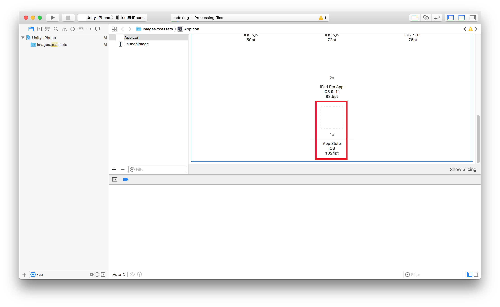

# Unity3DiOS11IconSetter

ios11이 업데이트 되면서 AppStore에 표시되는 아이콘 정보를 app에서 읽어오게 바뀐것으로 보입니다.

이에 따라 빌드에 반드시 "App Store iOS 1024pt" 아이콘이 추가 되야 합니다.
해당 아이콘이 없으면 rejected 사유가 됩니다.

Unity3D로 XCode project를 export 할 경우 images.xcassets의 정보를 매번 지우고 다시 생성하기때문에 매 빌드마다 수동으로 아이콘을 셋팅해야 하는 어려움이 있습니다.

이 스크립트는 빌드때마다 특정경로에 있는 아이콘으로 덮어써주는 기능을 합니다.

# 사용시 주의점
사용할 이미지는 1024*1024 pt, 투명값이 없는 RGB Png 파일이어야 합니다.

사용할 이미지에는 border rounding 같은 효과가 없어야 합니다.

# 개선할 사항
- playerSetting에 있는 default icon을 이용한 처리
- -  아직까지는 해당 아이콘 정보를 가져올 수 없음.
- png 파일 속성이 올바른지 체크하는 기능

# 테스트 환경
Unity3d 5.3.4 f1
